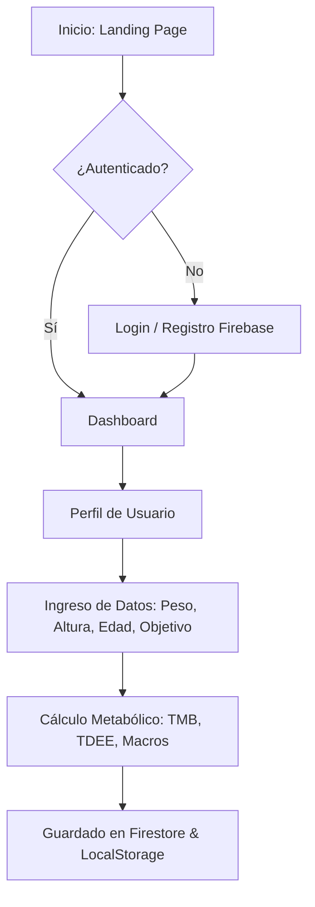
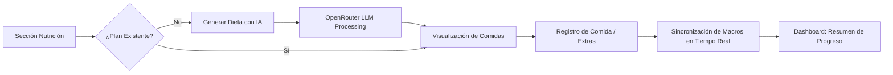
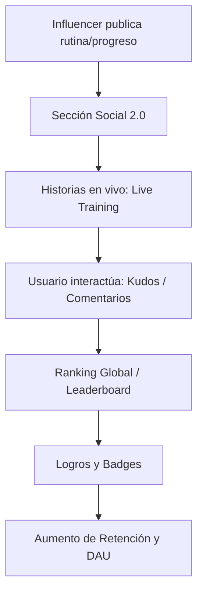
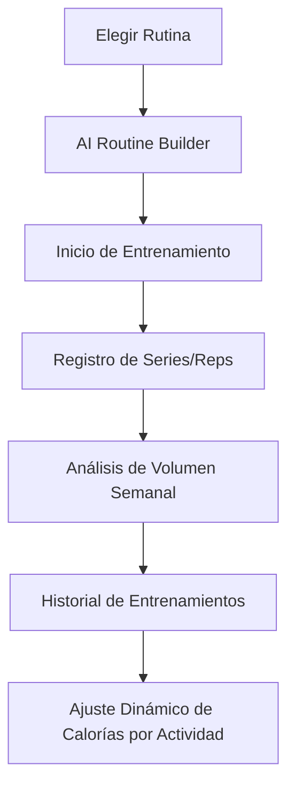

# Mapa Conceptual de Flujos - FitAI

Este documento visualiza los flujos principales de la aplicación, desde el aterrizaje del usuario hasta el ciclo de retención y fidelización.

## 1. Flujo de Onboarding y Perfil Metabólico
El usuario ingresa sus datos y obtenemos su firma metabólica única.

## 2. Ciclo Diario de Nutrición IA
El corazón de la experiencia de usuario personalizada.

## 3. Flujo Social y Retención (Gamificación)
Cómo los influencers fitness interactúan con sus seguidores.

## 4. Flujo de Entrenamiento y Tracking
Sincronización entre el plan y la ejecución.

